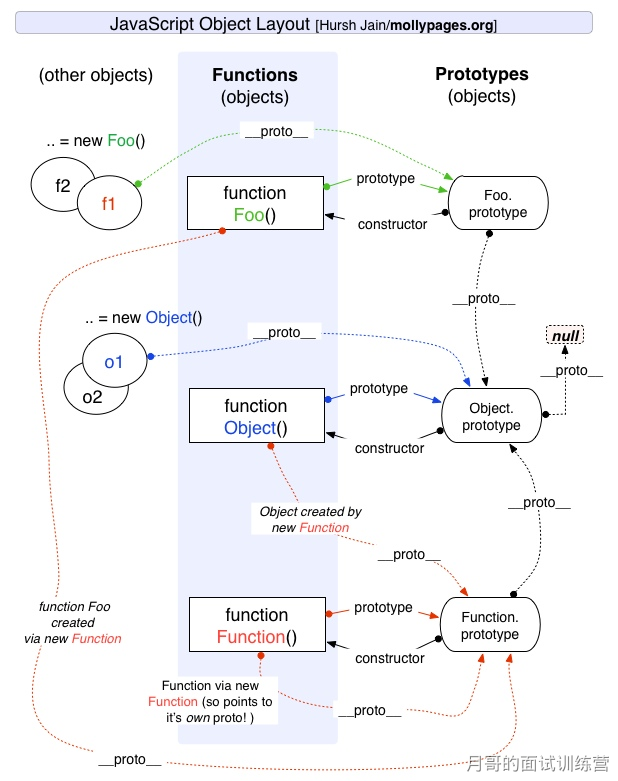

## Prototype and prototype chain

### Understanding of prototype and prototype chain

In JavaScript, a constructor is used to create a new object. Each constructor has an prototype attribute inside. Its attribute value is an object that contains attributes and methods that can be shared by all instances of the constructor. When you use a constructor to create an object, a pointer is included inside the object. The pointer points to the value corresponding to the prototype property of the constructor. In ES5, this pointer is called the prototype of the object. Generally speaking, this value should not be obtained, but now it is implemented in browsers proto property to access this property, but it is best not to use this property, because it is not specified in the specification. An Object.getPrototypeOf() method is added to ES5. You can use this method to obtain the prototype of an Object.

When accessing the attributes of an object, if this attribute does not exist inside the object, it will look for this attribute in its prototype object, and the prototype object will have its own prototype, so it keeps looking for this, that is, the concept of prototype chain. The end of the prototype chain is generally Object.prototype, so this is why new objects can use methods such as toString().

**Features:** JavaScript object is passed by reference, each new object entity created does not have its own prototype copy. When modifying the prototype, the related objects will also inherit this change.



### Prototype modification and rewriting

```js
function Person(name) {
  this.name = name;
}
// modification
Person.prototype.getName = function () {};
var p = new Person("hello");
console.log(p.__proto__ === Person.prototype); // true
console.log(p.__proto__ === p.constructor.prototype); // true
// rewriting
Person.prototype = {
  getName: function () {},
};
var p = new Person("hello");
console.log(p.__proto__ === Person.prototype); // true
console.log(p.__proto__ === p.constructor.prototype); // false
```

It can be seen that the constructor of p does not point to Person when modifying the prototype, because when directly assigning values to the prototype Object of Person, its constructor points to the root constructor Object, so at this time p. constructor = = = Object , not p. constructor = = = Person . If you want to be established, you must use constructor to point it back:

```js
Person.prototype = {
  getName: function () {},
};
var p = new Person("hello");
p.constructor = Person;
console.log(p.__proto__ === Person.prototype); // true
console.log(p.__proto__ === p.constructor.prototype); // true
```

### Prototype chain pointing

```js
p.__proto__; // Person.prototype
Person.prototype.__proto__; // Object.prototype
p.__proto__.__proto__; //Object.prototype
p.__proto__.constructor.prototype.__proto__; // Object.prototype
Person.prototype.constructor.prototype.__proto__; // Object.prototype
p1.__proto__.constructor; // Person
Person.prototype.constructor; // Person
```

```js
p.__proto__; // Person.prototype
Person.prototype.__proto__; // Object.prototype
p.__proto__.__proto__; //Object.prototype
p.__proto__.constructor.prototype.__proto__; // Object.prototype
Person.prototype.constructor.prototype.__proto__; // Object.prototype
p1.__proto__.constructor; // Person
Person.prototype.constructor; // Person
```

### What is the end point of the prototype chain? How do I print the end point of the prototype chain?

Because Object is a constructor, the end of the prototype chain is Object. prototype.**proto** , and Object. prototype.**proto ** = = = null//true , so, the end point of the prototype chain is null . All prototypes on the prototype chain are objects, and all objects are ultimately created Object constructed, and Object. prototype the next level is Object. prototype.**proto** .

### How to obtain the attributes on the non-prototype chain of an object?

Use hasOwnProperty () method to determine whether an attribute belongs to the attributes of the prototype chain:

```js
function iterate(obj) {
  var res = [];
  for (var key in obj) {
    if (obj.hasOwnProperty(key)) res.push(key + ": " + obj[key]);
  }
  return res;
}
```
