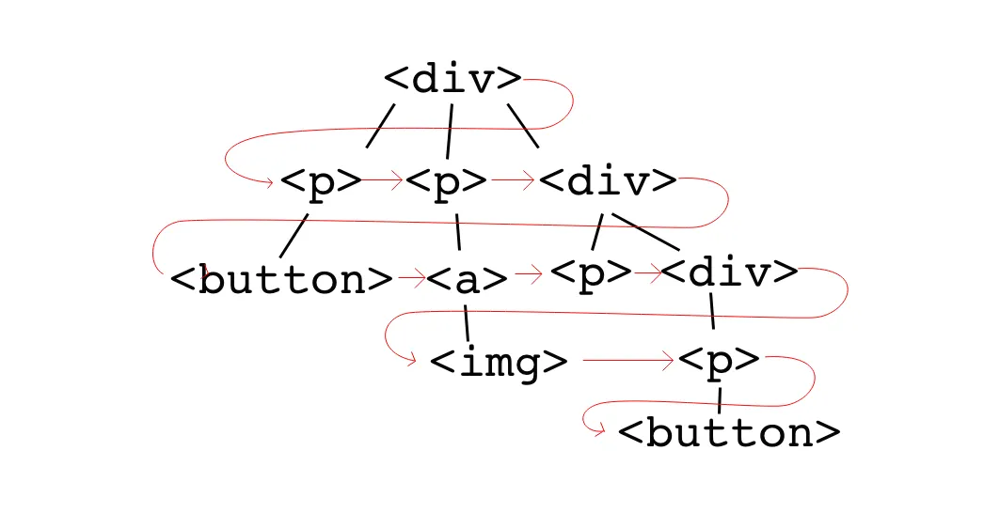

## Traverse DOM level by level

requirements:
Given a DOM tree, flatten it into an one dimensional array, in the order of layer by layer, like below.

As you know, the DOM tree structure like blow.



```js
{
  nodeName: 'div',
    children: [
    {
      nodeName: 'p',
      children: [
        {
          nodeName: 'button',
          children: []
        }
      ]
    },
    {
      nodeName: 'p',
      children: [
        {
          nodeName: 'a',
          children: []
        }
      ]
    },
    {
      nodeName: 'p',
      children: [
        {
          nodeName: 'p',
          children: []
        },
        {
          nodeName: 'div',
          children: []
        }
      ]
    }
  ]
}
```

we're going to use the queue concept, first in first out.
First, Push the root into the queue. like `[root]`.
And then take out the first item and push all children of the root into the queue.Until the length of the queue is 0. So, let's do it.

```js
/**
 * @param {HTMLElement | null} root
 * @return {HTMLElement[]}
 */
function flatten(root) {
  if (root === null) return [];
}
```

To handle this situation that its passed-in parameter may be null.
First, Push the root into the queue.

```js
function flatten(root) {
  if (root === null) return [];
  const queue = [root];
  let result = [];
  while (queue.length !== 0) {
    const item = queue.shift();
    result.push(item);
    queue.push(...item.children);
  }
  return result;
}
```

It needs continuously take out the first item in the queue.And push children of the queue item that was taken out presently into the queue.It will add the children nodes of each level to the queue.
So, when the queue don't have any node, we get all nodes.
